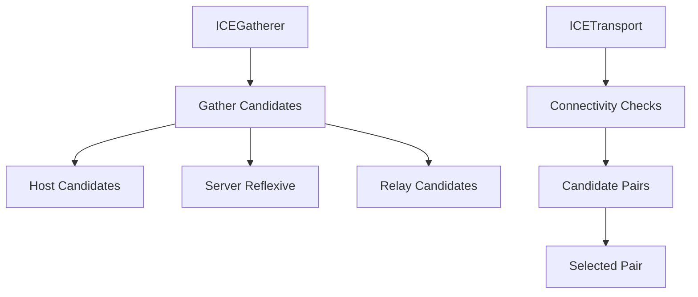

## What is ICE?

Interactive Connectivity Establishment (ICE) is a framework for establishing peer-to-peer connections across NATs and firewalls. It combines multiple techniques (STUN, TURN) to find the best path for communication.

## ICE Components in Pion

Pion WebRTC implements ICE through several components:



### ICEGatherer

The `ICEGatherer` collects local network addresses and contacts STUN/TURN servers:

```go icegatherer.go
// ICEGatherer gathers local host, server reflexive and relay
// candidates, as well as enabling the retrieval of local Interactive
// Connectivity Establishment (ICE) parameters which can be
// exchanged in signaling.
type ICEGatherer struct {
    lock  sync.RWMutex
    log   logging.LeveledLogger
    state ICEGathererState

    validatedServers []*stun.URI
    gatherPolicy     ICETransportPolicy

    agent *ice.Agent

    onLocalCandidateHandler atomic.Value // func(candidate *ICECandidate)
    onStateChangeHandler    atomic.Value // func(state ICEGathererState)

    api *API
}
```

### ICETransport

The `ICETransport` manages the connectivity checking process:

```go icetransport.go
// ICETransport allows an application access to information about the ICE
// transport over which packets are sent and received.
type ICETransport struct {
    lock sync.RWMutex

    role ICERole

    onConnectionStateChangeHandler         atomic.Value // func(ICETransportState)
    internalOnConnectionStateChangeHandler atomic.Value // func(ICETransportState)
    onSelectedCandidatePairChangeHandler   atomic.Value // func(*ICECandidatePair)

    state atomic.Value // ICETransportState

    gatherer *ICEGatherer
    conn     *ice.Conn
    mux      *mux.Mux

    loggerFactory logging.LoggerFactory
    log           logging.LeveledLogger
}
```

## ICE Candidate Types

Pion supports all standard ICE candidate types:

<CardGroup cols={2}>
  <Card title="Host" icon="computer">
    Local IP addresses discovered on the device's network interfaces.
  </Card>
  <Card title="Server Reflexive (srflx)" icon="globe">
    Public IP address as seen by a STUN server.
  </Card>
  <Card title="Peer Reflexive (prflx)" icon="users">
    Discovered during connectivity checks.
  </Card>
  <Card title="Relay" icon="tower-broadcast">
    Address allocated on a TURN server for relaying traffic.
  </Card>
</CardGroup>

### ICECandidate Structure

```go icecandidate.go
// ICECandidate represents a ice candidate.
type ICECandidate struct {
    statsID        string
    Foundation     string           `json:"foundation"`
    Priority       uint32           `json:"priority"`
    Address        string           `json:"address"`
    Protocol       ICEProtocol      `json:"protocol"`
    Port           uint16           `json:"port"`
    Typ            ICECandidateType `json:"type"`
    Component      uint16           `json:"component"`
    RelatedAddress string           `json:"relatedAddress"`
    RelatedPort    uint16           `json:"relatedPort"`
    TCPType        string           `json:"tcpType"`
    SDPMid         string           `json:"sdpMid"`
    SDPMLineIndex  uint16           `json:"sdpMLineIndex"`
}
```

## Gathering Candidates

### Basic Gathering

```go
pc, err := webrtc.NewPeerConnection(webrtc.Configuration{
    ICEServers: []webrtc.ICEServer{
        {
            URLs: []string{"stun:stun.l.google.com:19302"},
        },
    },
})

pc.OnICECandidate(func(candidate *webrtc.ICECandidate) {
    if candidate == nil {
        fmt.Println("ICE gathering complete")
        return
    }
    
    fmt.Printf("New ICE candidate: %s\n", candidate)
    // Send candidate to remote peer
    sendToRemotePeer(candidate.ToJSON())
})
```

The gathering process from the source:

```go icegatherer.go
// Gather ICE candidates.
func (g *ICEGatherer) Gather() error {
    if err := g.createAgent(); err != nil {
        return err
    }

    agent := g.getAgent()
    if agent == nil {
        return fmt.Errorf("%w: unable to gather", errICEAgentNotExist)
    }

    g.setState(ICEGathererStateGathering)
    if err := agent.OnCandidate(func(candidate ice.Candidate) {
        onLocalCandidateHandler := func(*ICECandidate) {}
        if handler, ok := g.onLocalCandidateHandler.Load().(func(candidate *ICECandidate)); ok && handler != nil {
            onLocalCandidateHandler = handler
        }

        if candidate != nil {
            c, err := newICECandidateFromICE(candidate, sdpMid, sdpMLineIndex)
            if err != nil {
                g.log.Warnf("Failed to convert ice.Candidate: %s", err)
                return
            }
            onLocalCandidateHandler(&c)
        } else {
            g.setState(ICEGathererStateComplete)
            onLocalCandidateHandler(nil)
        }
    }); err != nil {
        return err
    }

    return agent.GatherCandidates()
}
```

### ICE Gathering States

<Steps>
  <Step title="New">
    Gatherer has been created but not started.
  </Step>
  <Step title="Gathering">
    Actively collecting candidates from network interfaces and servers.
  </Step>
  <Step title="Complete">
    All candidates have been gathered.
  </Step>
</Steps>

```go
pc.OnICEGatheringStateChange(func(state webrtc.ICEGatheringState) {
    fmt.Printf("ICE gathering state: %s\n", state)
})
```

## Configuring ICE Servers

### STUN Server

```go
config := webrtc.Configuration{
    ICEServers: []webrtc.ICEServer{
        {
            URLs: []string{"stun:stun.l.google.com:19302"},
        },
    },
}
```

### TURN Server

```go
config := webrtc.Configuration{
    ICEServers: []webrtc.ICEServer{
        {
            URLs:       []string{"turn:turn.example.com:3478"},
            Username:   "username",
            Credential: "password",
        },
    },
}
```

### Multiple Servers

```go
config := webrtc.Configuration{
    ICEServers: []webrtc.ICEServer{
        {
            URLs: []string{
                "stun:stun.l.google.com:19302",
                "stun:stun1.l.google.com:19302",
            },
        },
        {
            URLs: []string{
                "turn:turn1.example.com:3478?transport=udp",
                "turn:turn1.example.com:3478?transport=tcp",
                "turns:turn1.example.com:5349",
            },
            Username:   "user",
            Credential: "pass",
        },
    },
}
```

<Note>
TURN servers are used as a fallback when direct peer-to-peer connections fail. They relay all media traffic, so they can be expensive to operate.
</Note>

## ICE Transport Policies

```go
config := webrtc.Configuration{
    // Allow all candidate types
    ICETransportPolicy: webrtc.ICETransportPolicyAll,
    
    // Or force relay (TURN) only
    // ICETransportPolicy: webrtc.ICETransportPolicyRelay,
}
```

How the policy is applied:

```go icegatherer.go
func (g *ICEGatherer) resolveCandidateTypes() []ice.CandidateType {
    if g.api.settingEngine.candidates.ICELite {
        return []ice.CandidateType{ice.CandidateTypeHost}
    }

    switch g.gatherPolicy {
    case ICETransportPolicyRelay:
        return []ice.CandidateType{ice.CandidateTypeRelay}
    case ICETransportPolicyNoHost:
        return []ice.CandidateType{ice.CandidateTypeServerReflexive, ice.CandidateTypeRelay}
    default:
    }

    return nil
}
```

## ICE Connection States

The ICE connection goes through several states:

```go icetransport.go
func (pc *PeerConnection) createICETransport() *ICETransport {
    transport := pc.api.NewICETransport(pc.iceGatherer)
    transport.internalOnConnectionStateChangeHandler.Store(func(state ICETransportState) {
        var cs ICEConnectionState
        switch state {
        case ICETransportStateNew:
            cs = ICEConnectionStateNew
        case ICETransportStateChecking:
            cs = ICEConnectionStateChecking
        case ICETransportStateConnected:
            cs = ICEConnectionStateConnected
        case ICETransportStateCompleted:
            cs = ICEConnectionStateCompleted
        case ICETransportStateFailed:
            cs = ICEConnectionStateFailed
        case ICETransportStateDisconnected:
            cs = ICEConnectionStateDisconnected
        case ICETransportStateClosed:
            cs = ICEConnectionStateClosed
        }
        pc.onICEConnectionStateChange(cs)
        pc.updateConnectionState(cs, pc.dtlsTransport.State())
    })

    return transport
}
```

### Monitoring ICE State

```go
pc.OnICEConnectionStateChange(func(state webrtc.ICEConnectionState) {
    fmt.Printf("ICE connection state: %s\n", state)
    
    switch state {
    case webrtc.ICEConnectionStateChecking:
        fmt.Println("Testing connectivity...")
    case webrtc.ICEConnectionStateConnected:
        fmt.Println("Connectivity established!")
    case webrtc.ICEConnectionStateFailed:
        fmt.Println("Connection failed - check firewall/NAT")
    case webrtc.ICEConnectionStateDisconnected:
        fmt.Println("Connection lost")
    }
})
```

## Adding Remote Candidates

```go icetransport.go
// AddRemoteCandidate adds a candidate associated with the remote ICETransport.
func (t *ICETransport) AddRemoteCandidate(remoteCandidate *ICECandidate) error {
    t.lock.RLock()
    defer t.lock.RUnlock()

    var (
        candidate ice.Candidate
        err       error
    )

    if err = t.ensureGatherer(); err != nil {
        return err
    }

    if remoteCandidate != nil {
        if candidate, err = remoteCandidate.ToICE(); err != nil {
            return err
        }
    }

    agent := t.gatherer.getAgent()
    if agent == nil {
        return fmt.Errorf("%w: unable to add remote candidates", errICEAgentNotExist)
    }

    return agent.AddRemoteCandidate(candidate)
}
```

Usage:

```go
// Receive candidate from remote peer
var candidateInit webrtc.ICECandidateInit
receiveFromRemotePeer(&candidateInit)

// Add to PeerConnection
if err := pc.AddICECandidate(candidateInit); err != nil {
    log.Printf("Error adding ICE candidate: %v", err)
}
```

## Selected Candidate Pair

Once connectivity is established, you can inspect the selected candidate pair:

```go icetransport.go
func (t *ICETransport) GetSelectedCandidatePair() (*ICECandidatePair, error) {
    agent := t.gatherer.getAgent()
    if agent == nil {
        return nil, nil
    }

    icePair, err := agent.GetSelectedCandidatePair()
    if icePair == nil || err != nil {
        return nil, err
    }

    local, err := newICECandidateFromICE(icePair.Local, "", 0)
    if err != nil {
        return nil, err
    }

    remote, err := newICECandidateFromICE(icePair.Remote, "", 0)
    if err != nil {
        return nil, err
    }

    return NewICECandidatePair(&local, &remote), nil
}
```

Monitor selected pair changes:

```go
pc.OnICEConnectionStateChange(func(state webrtc.ICEConnectionState) {
    if state == webrtc.ICEConnectionStateConnected {
        // Get selected candidate pair
        pair, err := pc.SCTP().Transport().ICETransport().GetSelectedCandidatePair()
        if err == nil && pair != nil {
            fmt.Printf("Connected via:\n")
            fmt.Printf("  Local:  %s:%d (%s)\n", 
                pair.Local.Address, pair.Local.Port, pair.Local.Typ)
            fmt.Printf("  Remote: %s:%d (%s)\n", 
                pair.Remote.Address, pair.Remote.Port, pair.Remote.Typ)
        }
    }
})
```

## ICE Restart

Restart ICE to recover from connection failures:

```go
// Create new offer with ICE restart
offer, err := pc.CreateOffer(&webrtc.OfferOptions{
    ICERestart: true,
})
if err != nil {
    panic(err)
}

if err = pc.SetLocalDescription(offer); err != nil {
    panic(err)
}

sendToRemotePeer(offer)
```

The restart implementation:

```go icetransport.go
func (t *ICETransport) restart() error {
    t.lock.Lock()
    defer t.lock.Unlock()

    agent := t.gatherer.getAgent()
    if agent == nil {
        return fmt.Errorf("%w: unable to restart ICETransport", errICEAgentNotExist)
    }

    if err := agent.Restart(
        t.gatherer.api.settingEngine.candidates.UsernameFragment,
        t.gatherer.api.settingEngine.candidates.Password,
    ); err != nil {
        return err
    }

    return t.gatherer.Gather()
}
```

## Advanced ICE Configuration

### Setting ICE Credentials

```go
import "github.com/pion/webrtc/v4"

api := webrtc.NewAPI(webrtc.WithSettingEngine(webrtc.SettingEngine{
    // Custom ICE credentials
}))
```

### Network Interface Filtering

```go
settingEngine := webrtc.SettingEngine{}
settingEngine.SetInterfaceFilter(func(iface string) bool {
    // Only use WiFi interface
    return strings.HasPrefix(iface, "wlan")
})

api := webrtc.NewAPI(webrtc.WithSettingEngine(settingEngine))
```

### ICE Timeouts

```go
import "time"

settingEngine := webrtc.SettingEngine{}
settingEngine.SetICETimeouts(
    30*time.Second, // Disconnected timeout
    10*time.Second, // Failed timeout
    2*time.Second,  // Keepalive interval
)

api := webrtc.NewAPI(webrtc.WithSettingEngine(settingEngine))
```

## Troubleshooting ICE

<Warning>
Common ICE connection failures:
- Restrictive firewalls blocking UDP
- No TURN server configured for relay fallback
- Symmetric NAT requiring TURN
- IPv6 connectivity issues
</Warning>

### Diagnostic Tips

1. **Check gathered candidates**:
```go
pc.OnICECandidate(func(c *webrtc.ICECandidate) {
    if c != nil {
        fmt.Printf("Candidate: %s\n", c.String())
    }
})
```

2. **Monitor connection states**:
```go
pc.OnICEConnectionStateChange(func(state webrtc.ICEConnectionState) {
    log.Printf("ICE: %s", state)
})
```

3. **Enable ICE agent logging**:
```go
import "github.com/pion/logging"

loggerFactory := logging.NewDefaultLoggerFactory()
loggerFactory.DefaultLogLevel = logging.LogLevelTrace

settingEngine := webrtc.SettingEngine{}
settingEngine.LoggerFactory = loggerFactory
```

## Next Steps

<CardGroup cols={2}>
  <Card title="Media Streams" href="/concepts/media-streams">
    Learn about sending and receiving media
  </Card>
  <Card title="Data Channels" href="/concepts/data-channels">
    Explore bidirectional data transfer
  </Card>
</CardGroup>
