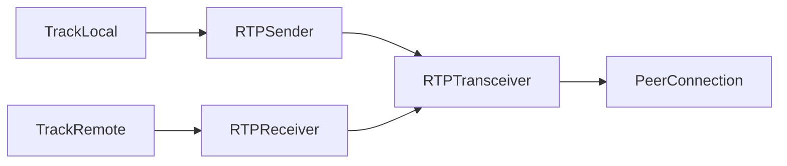

## Overview

Media streams in Pion WebRTC consist of audio and video tracks managed by RTP transceivers. Unlike browser WebRTC, Pion gives you low-level access to RTP packets and fine-grained control over media processing.

## Core Components



### Track Types

<CardGroup cols={2}>
  <Card title="TrackLocal" icon="upload">
    Sends media from your application to remote peers.
  </Card>
  <Card title="TrackRemote" icon="download">
    Receives media from remote peers.
  </Card>
</CardGroup>

## TrackLocal Interface

The `TrackLocal` interface defines how media is sent:

```go track_local.go
// TrackLocal is an interface that controls how the user can send media
// The user can provide their own TrackLocal implementations, or use
// the implementations in pkg/media.
type TrackLocal interface {
    // Bind should implement the way how the media data flows from the Track to the PeerConnection
    Bind(TrackLocalContext) (RTPCodecParameters, error)

    // Unbind should implement the teardown logic when the track is no longer needed
    Unbind(TrackLocalContext) error

    // ID is the unique identifier for this Track
    ID() string

    // RID is the RTP Stream ID for this track
    RID() string

    // StreamID is the group this track belongs too
    StreamID() string

    // Kind controls if this TrackLocal is audio or video
    Kind() RTPCodecType
}
```

### TrackLocalContext

```go track_local.go
// TrackLocalContext is the Context passed when a TrackLocal has been Binded/Unbinded
type TrackLocalContext interface {
    // CodecParameters returns the negotiated RTPCodecParameters
    CodecParameters() []RTPCodecParameters

    // HeaderExtensions returns the negotiated RTPHeaderExtensionParameters
    HeaderExtensions() []RTPHeaderExtensionParameter

    // SSRC returns the negotiated SSRC of this track
    SSRC() SSRC

    // SSRCRetransmission returns the negotiated SSRC used to send retransmissions
    SSRCRetransmission() SSRC

    // SSRCForwardErrorCorrection returns the negotiated SSRC for FEC
    SSRCForwardErrorCorrection() SSRC

    // WriteStream returns the WriteStream for this TrackLocal
    WriteStream() TrackLocalWriter

    // RTCPReader returns the RTCP interceptor for this TrackLocal
    RTCPReader() interceptor.RTCPReader
}
```

## Creating Local Tracks

### Static Sample Track

For sending pre-recorded or generated media:

```go
import "github.com/pion/webrtc/v4"

// Create a video track
videoTrack, err := webrtc.NewTrackLocalStaticSample(
    webrtc.RTPCodecCapability{MimeType: webrtc.MimeTypeVP8},
    "video",
    "pion-video",
)
if err != nil {
    panic(err)
}

// Create an audio track
audioTrack, err := webrtc.NewTrackLocalStaticSample(
    webrtc.RTPCodecCapability{MimeType: webrtc.MimeTypeOpus},
    "audio",
    "pion-audio",
)
if err != nil {
    panic(err)
}
```

### Writing to Tracks

```go
import (
    "github.com/pion/rtp"
    "time"
)

// Write video samples
go func() {
    ticker := time.NewTicker(33 * time.Millisecond) // ~30 fps
    defer ticker.Stop()
    
    for range ticker.C {
        // Get video frame (from file, camera, etc.)
        frame := getNextVideoFrame()
        
        if err := videoTrack.WriteSample(media.Sample{
            Data:     frame,
            Duration: 33 * time.Millisecond,
        }); err != nil {
            return
        }
    }
}()
```

### Writing RTP Packets Directly

```go
import "github.com/pion/rtp"

// Create a track for direct RTP writing
track, err := webrtc.NewTrackLocalStaticRTP(
    webrtc.RTPCodecCapability{MimeType: webrtc.MimeTypeVP8},
    "video",
    "pion",
)

// Write RTP packet
packet := &rtp.Packet{
    Header: rtp.Header{
        Version:        2,
        PayloadType:    96,
        SequenceNumber: sequenceNumber,
        Timestamp:      timestamp,
        SSRC:           track.SSRC(),
    },
    Payload: payload,
}

if err := track.WriteRTP(packet); err != nil {
    log.Printf("Error writing RTP: %v", err)
}
```

## Adding Tracks to PeerConnection

```go
// Add track to peer connection
sender, err := pc.AddTrack(videoTrack)
if err != nil {
    panic(err)
}

// Read RTCP packets for this track
go func() {
    rtcpBuf := make([]byte, 1500)
    for {
        n, _, err := sender.Read(rtcpBuf)
        if err != nil {
            return
        }
        
        // Handle RTCP feedback
        handleRTCP(rtcpBuf[:n])
    }
}()
```

<Note>
Always read RTCP packets from the sender to handle feedback like PLI (Picture Loss Indication) and NACK (Negative Acknowledgment) requests.
</Note>

## RTPSender

The `RTPSender` manages outgoing media:

```go rtpsender.go
// RTPSender allows an application to control how a given Track is encoded
// and transmitted to a remote peer.
type RTPSender struct {
    trackEncodings []*trackEncoding

    transport *DTLSTransport

    payloadType PayloadType
    kind        RTPCodecType

    api *API
    id  string

    rtpTransceiver *RTPTransceiver

    mu                     sync.RWMutex
    sendCalled, stopCalled chan struct{}
}
```

### Reading RTCP Feedback

```go rtpsender.go
func handleSenderRTCP(sender *webrtc.RTPSender, track webrtc.TrackLocal) {
    for {
        packets, _, err := sender.ReadRTCP()
        if err != nil {
            return
        }
        
        for _, packet := range packets {
            switch pkt := packet.(type) {
            case *rtcp.PictureLossIndication:
                // Requested keyframe
                fmt.Println("PLI received - send keyframe")
                
            case *rtcp.ReceiverReport:
                // Statistics from receiver
                fmt.Printf("Receiver report: %+v\n", pkt)
                
            case *rtcp.TransportLayerNack:
                // Packet loss detected
                fmt.Printf("NACK: %v\n", pkt.Nacks)
            }
        }
    }
}
```

## Receiving Media

### OnTrack Handler

```go
pc.OnTrack(func(track *webrtc.TrackRemote, receiver *webrtc.RTPReceiver) {
    fmt.Printf("Track received: kind=%s ssrc=%d\n", track.Kind(), track.SSRC())
    
    // Read RTP packets
    go func() {
        buf := make([]byte, 1500)
        for {
            n, _, err := track.Read(buf)
            if err != nil {
                return
            }
            
            // Process media packet
            processRTP(buf[:n], track.Kind())
        }
    }()
    
    // Read RTCP sender reports
    go func() {
        for {
            packets, _, err := receiver.ReadRTCP()
            if err != nil {
                return
            }
            
            for _, pkt := range packets {
                fmt.Printf("RTCP: %+v\n", pkt)
            }
        }
    }()
})
```

The OnTrack implementation from the source:

```go peerconnection.go
func (pc *PeerConnection) onTrack(t *TrackRemote, r *RTPReceiver) {
    pc.mu.RLock()
    handler := pc.onTrackHandler
    pc.mu.RUnlock()

    pc.log.Debugf("got new track: %+v", t)
    if t != nil {
        if handler != nil {
            go handler(t, r)
        } else {
            pc.log.Warnf("OnTrack unset, unable to handle incoming media streams")
        }
    }
}
```

## RTPReceiver

```go rtpreceiver.go
// RTPReceiver allows an application to inspect the receipt of a TrackRemote.
type RTPReceiver struct {
    kind      RTPCodecType
    transport *DTLSTransport

    tracks []trackStreams

    closed               atomic.Bool
    closedChan, received chan any
    mu                   sync.RWMutex

    api *API
    log logging.LeveledLogger
}
```

### Reading RTP Packets

```go
func readTrack(track *webrtc.TrackRemote) {
    buf := make([]byte, 1500)
    
    for {
        // Read RTP packet with attributes
        n, attributes, err := track.ReadRTP(buf)
        if err != nil {
            return
        }
        
        // Parse RTP packet
        packet := &rtp.Packet{}
        if err = packet.Unmarshal(buf[:n]); err != nil {
            continue
        }
        
        fmt.Printf("RTP seq=%d ts=%d ssrc=%d len=%d\n",
            packet.SequenceNumber,
            packet.Timestamp,
            packet.SSRC,
            len(packet.Payload),
        )
        
        // Access interceptor attributes if needed
        if attributes != nil {
            // Handle attributes
        }
        
        // Process payload
        processPayload(packet.Payload, track.Codec())
    }
}
```

## Codec Configuration

### Supported Codecs

```go
import "github.com/pion/webrtc/v4"

// Video codecs
webrtc.MimeTypeVP8  // "video/VP8"
webrtc.MimeTypeVP9  // "video/VP9"
webrtc.MimeTypeH264 // "video/H264"
webrtc.MimeTypeH265 // "video/H265"
webrtc.MimeTypeAV1  // "video/AV1"

// Audio codecs
webrtc.MimeTypeOpus // "audio/opus"
webrtc.MimeTypePCMU // "audio/PCMU"
webrtc.MimeTypePCMA // "audio/PCMA"
webrtc.MimeTypeG722 // "audio/G722"
```

### Custom Codec Parameters

```go
import "github.com/pion/webrtc/v4"

mediaEngine := &webrtc.MediaEngine{}

// Register VP8 with custom parameters
if err := mediaEngine.RegisterCodec(webrtc.RTPCodecParameters{
    RTPCodecCapability: webrtc.RTPCodecCapability{
        MimeType:     webrtc.MimeTypeVP8,
        ClockRate:    90000,
        Channels:     0,
        SDPFmtpLine:  "",
        RTCPFeedback: []webrtc.RTCPFeedback{
            {Type: "goog-remb"},
            {Type: "ccm", Parameter: "fir"},
            {Type: "nack"},
            {Type: "nack", Parameter: "pli"},
        },
    },
    PayloadType: 96,
}, webrtc.RTPCodecTypeVideo); err != nil {
    panic(err)
}

api := webrtc.NewAPI(webrtc.WithMediaEngine(mediaEngine))
```

## Simulcast

Send multiple quality layers simultaneously:

```go
// Create base track
baseTrack, _ := webrtc.NewTrackLocalStaticRTP(
    webrtc.RTPCodecCapability{MimeType: webrtc.MimeTypeVP8},
    "video",
    "simulcast",
)

sender, _ := pc.AddTrack(baseTrack)

// Add additional encodings for simulcast
for _, rid := range []string{"q", "h", "f"} {
    track, _ := webrtc.NewTrackLocalStaticRTP(
        webrtc.RTPCodecCapability{MimeType: webrtc.MimeTypeVP8},
        "video",
        "simulcast",
    )
    track.SetRID(rid)
    
    if err := sender.AddEncoding(track); err != nil {
        panic(err)
    }
}
```

<Tip>
Simulcast allows receivers to switch between quality layers based on their available bandwidth.
</Tip>

## RTP Header Extensions

```go
// Enable extensions in MediaEngine
mediaEngine := &webrtc.MediaEngine{}

// Audio level extension
mediaEngine.RegisterHeaderExtension(
    webrtc.RTPHeaderExtensionCapability{
        URI: "urn:ietf:params:rtp-hdrext:ssrc-audio-level",
    },
    webrtc.RTPCodecTypeAudio,
)

// Video orientation
mediaEngine.RegisterHeaderExtension(
    webrtc.RTPHeaderExtensionCapability{
        URI: "urn:3gpp:video-orientation",
    },
    webrtc.RTPCodecTypeVideo,
)
```

## Track Replacement

```go
// Replace track without renegotiation
newTrack, _ := webrtc.NewTrackLocalStaticSample(
    webrtc.RTPCodecCapability{MimeType: webrtc.MimeTypeVP8},
    "video-new",
    "pion",
)

if err := sender.ReplaceTrack(newTrack); err != nil {
    panic(err)
}
```

The implementation from source:

```go rtpsender.go
func (r *RTPSender) ReplaceTrack(track TrackLocal) error {
    r.mu.Lock()
    defer r.mu.Unlock()

    if track != nil && r.kind != track.Kind() {
        return ErrRTPSenderNewTrackHasIncorrectKind
    }

    // Cannot replace simulcast envelope
    if track != nil && len(r.trackEncodings) > 1 {
        return ErrRTPSenderNewTrackHasIncorrectEnvelope
    }

    var replacedTrack TrackLocal
    var context *baseTrackLocalContext
    for _, e := range r.trackEncodings {
        replacedTrack = e.track
        context = e.context

        if r.hasSent() && replacedTrack != nil {
            if err := replacedTrack.Unbind(context); err != nil {
                return err
            }
        }

        if !r.hasSent() || track == nil {
            e.track = track
        }
    }
    
    // Bind new track...
}
```

## Transceiver Direction

```go
// Add transceiver with specific direction
transceiver, err := pc.AddTransceiverFromKind(
    webrtc.RTPCodecTypeVideo,
    webrtc.RTPTransceiverInit{
        Direction: webrtc.RTPTransceiverDirectionSendonly,
    },
)

// Change direction later
transceiver.SetDirection(webrtc.RTPTransceiverDirectionSendrecv)
```

## Bandwidth Control

```go
import "github.com/pion/sdp/v3"

// Modify SDP to set bandwidth
offer, _ := pc.CreateOffer(nil)
parsed := &sdp.SessionDescription{}
parsed.UnmarshalString(offer.SDP)

for _, media := range parsed.MediaDescriptions {
    if media.MediaName.Media == "video" {
        // Set max bandwidth to 2 Mbps
        media.WithValueAttribute("b", "AS:2000")
    }
}

offer.SDP, _ = parsed.Marshal()
pc.SetLocalDescription(offer)
```

## Interceptors

Modify RTP/RTCP in flight:

```go
import "github.com/pion/interceptor"

interceptorRegistry := &interceptor.Registry{}

// Add NACK responder
if err := webrtc.ConfigureNack(mediaEngine, interceptorRegistry); err != nil {
    panic(err)
}

// Add TWCC (Transport Wide Congestion Control)
if err := webrtc.ConfigureTWCCSender(mediaEngine, interceptorRegistry); err != nil {
    panic(err)
}

api := webrtc.NewAPI(
    webrtc.WithMediaEngine(mediaEngine),
    webrtc.WithInterceptorRegistry(interceptorRegistry),
)
```

## Statistics

```go
stats := pc.GetStats()

for _, stat := range stats {
    switch s := stat.(type) {
    case webrtc.InboundRTPStreamStats:
        fmt.Printf("Inbound: packets=%d bytes=%d lost=%d jitter=%f\n",
            s.PacketsReceived, s.BytesReceived, s.PacketsLost, s.Jitter)
    case webrtc.OutboundRTPStreamStats:
        fmt.Printf("Outbound: packets=%d bytes=%d\n",
            s.PacketsSent, s.BytesSent)
    }
}
```

## Next Steps

<CardGroup cols={2}>
  <Card title="Data Channels" href="/concepts/data-channels">
    Learn about bidirectional data transfer
  </Card>
  <Card title="WebRTC Overview" href="/concepts/webrtc-overview">
    Review core concepts
  </Card>
</CardGroup>
