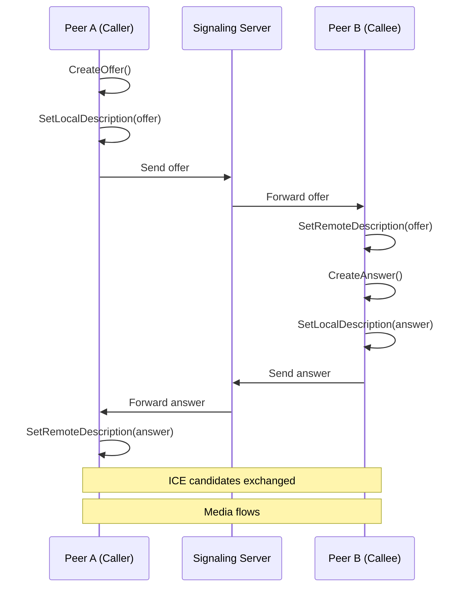

## What is Signaling?

Signaling is the process of coordinating communication between two peers. In WebRTC, this involves exchanging session information (SDP) and network connectivity information (ICE candidates) before a peer-to-peer connection can be established.

<Note>
WebRTC does not specify a signaling protocol - you can use WebSockets, HTTP, MQTT, or any other mechanism to exchange signaling messages between peers.
</Note>

## Session Description Protocol (SDP)

SDP is a text format that describes multimedia sessions. In Pion WebRTC, SDP is represented by the `SessionDescription` type:

```go sessiondescription.go
// SessionDescription is used to expose local and remote session descriptions.
type SessionDescription struct {
    Type SDPType `json:"type"`
    SDP  string  `json:"sdp"`

    // This will never be initialized by callers, internal use only
    parsed *sdp.SessionDescription
}
```

### SDP Types

There are four types of SDP messages:

<CardGroup cols={2}>
  <Card title="Offer" icon="paper-plane">
    Initial proposal from the caller with supported codecs, media tracks, and capabilities.
  </Card>
  <Card title="Answer" icon="reply">
    Response from the callee with its own capabilities, negotiated with the offer.
  </Card>
  <Card title="Pranswer" icon="hourglass">
    Provisional answer - a partial answer that may be updated later.
  </Card>
  <Card title="Rollback" icon="rotate-left">
    Cancel a previous offer/answer and return to the stable state.
  </Card>
</CardGroup>

## The Offer/Answer Exchange

The signaling process follows a well-defined sequence:



## Creating an Offer

The caller creates an offer describing its capabilities:

```go
// Create PeerConnection
pc, err := webrtc.NewPeerConnection(webrtc.Configuration{
    ICEServers: []webrtc.ICEServer{
        {URLs: []string{"stun:stun.l.google.com:19302"}},
    },
})
if err != nil {
    panic(err)
}

// Add media tracks before creating offer
videoTrack, _ := webrtc.NewTrackLocalStaticSample(
    webrtc.RTPCodecCapability{MimeType: webrtc.MimeTypeVP8},
    "video",
    "pion",
)
pc.AddTrack(videoTrack)

// Create offer
offer, err := pc.CreateOffer(nil)
if err != nil {
    panic(err)
}

// Set as local description
if err = pc.SetLocalDescription(offer); err != nil {
    panic(err)
}

// Send offer to remote peer
sendViaSignaling(offer)
```

From the source code, here's how offers are created:

```go peerconnection.go
func (pc *PeerConnection) CreateOffer(options *OfferOptions) (SessionDescription, error) {
    useIdentity := pc.idpLoginURL != nil
    switch {
    case useIdentity:
        return SessionDescription{}, errIdentityProviderNotImplemented
    case pc.isClosed.Load():
        return SessionDescription{}, &rtcerr.InvalidStateError{Err: ErrConnectionClosed}
    }

    if options != nil && options.ICERestart {
        if err := pc.iceTransport.restart(); err != nil {
            return SessionDescription{}, err
        }
    }
    
    // Generate SDP based on current transceivers and configuration
    // ...
    
    offer = SessionDescription{
        Type:   SDPTypeOffer,
        SDP:    string(sdpBytes),
        parsed: descr,
    }
    
    pc.lastOffer = offer.SDP
    return offer, nil
}
```

<Tip>
Add all your tracks and data channels before calling `CreateOffer()` to include them in the initial negotiation.
</Tip>

## Creating an Answer

The callee receives the offer and creates an answer:

```go
// Receive offer from remote peer
var offer webrtc.SessionDescription
receiveViaSignaling(&offer)

// Set remote description
if err := pc.SetRemoteDescription(offer); err != nil {
    panic(err)
}

// Create answer
answer, err := pc.CreateAnswer(nil)
if err != nil {
    panic(err)
}

// Set as local description
if err = pc.SetLocalDescription(answer); err != nil {
    panic(err)
}

// Send answer back
sendViaSignaling(answer)
```

The answer creation logic:

```go peerconnection.go
func (pc *PeerConnection) CreateAnswer(options *AnswerOptions) (SessionDescription, error) {
    remoteDesc := pc.RemoteDescription()
    switch {
    case remoteDesc == nil:
        return SessionDescription{}, &rtcerr.InvalidStateError{Err: ErrNoRemoteDescription}
    case pc.isClosed.Load():
        return SessionDescription{}, &rtcerr.InvalidStateError{Err: ErrConnectionClosed}
    case pc.signalingState.Get() != SignalingStateHaveRemoteOffer &&
         pc.signalingState.Get() != SignalingStateHaveLocalPranswer:
        return SessionDescription{}, &rtcerr.InvalidStateError{Err: ErrIncorrectSignalingState}
    }
    
    // Generate answer matching the offer
    desc := SessionDescription{
        Type:   SDPTypeAnswer,
        SDP:    string(sdpBytes),
        parsed: descr,
    }
    pc.lastAnswer = desc.SDP
    
    return desc, nil
}
```

<Warning>
You must set the remote description before creating an answer. The answer is generated based on the received offer.
</Warning>

## Setting Descriptions

### Local Description

Setting the local description commits your offer or answer:

```go peerconnection.go
func (pc *PeerConnection) SetLocalDescription(desc SessionDescription) error {
    if pc.isClosed.Load() {
        return &rtcerr.InvalidStateError{Err: ErrConnectionClosed}
    }

    haveLocalDescription := pc.currentLocalDescription != nil

    // JSEP 5.4 - Allow passing empty SDP
    if desc.SDP == "" {
        switch desc.Type {
        case SDPTypeAnswer, SDPTypePranswer:
            desc.SDP = pc.lastAnswer
        case SDPTypeOffer:
            desc.SDP = pc.lastOffer
        default:
            return &rtcerr.InvalidModificationError{
                Err: fmt.Errorf("%w: %s", errPeerConnSDPTypeInvalidValueSetLocalDescription, desc.Type),
            }
        }
    }

    // Parse SDP
    desc.parsed = &sdp.SessionDescription{}
    if err := desc.parsed.UnmarshalString(desc.SDP); err != nil {
        return err
    }
    
    // Update signaling state
    if err := pc.setDescription(&desc, stateChangeOpSetLocal); err != nil {
        return err
    }
    
    // Start ICE gathering
    if pc.iceGatherer.State() == ICEGathererStateNew {
        return pc.iceGatherer.Gather()
    }
    
    return nil
}
```

### Remote Description

```go peerconnection.go
func (pc *PeerConnection) SetRemoteDescription(desc SessionDescription) error {
    if pc.isClosed.Load() {
        return &rtcerr.InvalidStateError{Err: ErrConnectionClosed}
    }

    isRenegotiation := pc.currentRemoteDescription != nil

    if _, err := desc.Unmarshal(); err != nil {
        return err
    }

    if err := pc.setDescription(&desc, stateChangeOpSetRemote); err != nil {
        return err
    }

    // Extract and add ICE candidates from SDP
    iceDetails, err := extractICEDetails(desc.parsed, pc.log)
    if err != nil {
        return err
    }

    for i := range iceDetails.Candidates {
        if err = pc.iceTransport.AddRemoteCandidate(&iceDetails.Candidates[i]); err != nil {
            return err
        }
    }
    
    // Start transports if this is the first time
    if !isRenegotiation {
        // Start ICE, DTLS, etc.
    }
    
    return nil
}
```

## ICE Trickle

ICE trickle allows sending candidates incrementally rather than waiting for all candidates:

```go sessiondescription.go
// ICETrickleCapability represents whether the remote endpoint accepts
// trickled ICE candidates.
type ICETrickleCapability int

const (
    ICETrickleCapabilityUnknown ICETrickleCapability = iota
    ICETrickleCapabilitySupported
    ICETrickleCapabilityUnsupported
)

func hasICETrickleOption(desc *sdp.SessionDescription) bool {
    if value, ok := desc.Attribute(sdp.AttrKeyICEOptions); ok && hasTrickleOptionValue(value) {
        return true
    }
    
    for _, media := range desc.MediaDescriptions {
        if value, ok := media.Attribute(sdp.AttrKeyICEOptions); ok && hasTrickleOptionValue(value) {
            return true
        }
    }
    
    return false
}
```

Implementing trickle ICE:

```go
// Send ICE candidates as they're gathered
pc.OnICECandidate(func(candidate *webrtc.ICECandidate) {
    if candidate == nil {
        // Gathering complete
        return
    }
    
    // Send candidate to remote peer
    sendViaSignaling(candidate.ToJSON())
})

// Receive and add remote ICE candidates
func handleRemoteCandidate(candidateJSON webrtc.ICECandidateInit) {
    if err := pc.AddICECandidate(candidateJSON); err != nil {
        log.Printf("Error adding ICE candidate: %v", err)
    }
}
```

<Note>
Trickle ICE significantly reduces connection setup time by allowing ICE candidate exchange to happen in parallel with the offer/answer exchange.
</Note>

## Perfect Negotiation

Perfect negotiation is a pattern that eliminates glare (both sides creating offers simultaneously):

```go
var (
    makingOffer = false
    isPolite    = false // One peer is polite, the other is impolite
)

pc.OnNegotiationNeeded(func() {
    makingOffer = true
    defer func() { makingOffer = false }()
    
    offer, err := pc.CreateOffer(nil)
    if err != nil {
        return
    }
    
    if err = pc.SetLocalDescription(offer); err != nil {
        return
    }
    
    sendViaSignaling(offer)
})

func handleRemoteDescription(desc webrtc.SessionDescription) {
    offerCollision := desc.Type == webrtc.SDPTypeOffer &&
                      (makingOffer || pc.SignalingState() != webrtc.SignalingStateStable)
    
    ignoreOffer := !isPolite && offerCollision
    if ignoreOffer {
        return
    }
    
    if err := pc.SetRemoteDescription(desc); err != nil {
        log.Printf("Error setting remote description: %v", err)
        return
    }
    
    if desc.Type == webrtc.SDPTypeOffer {
        answer, err := pc.CreateAnswer(nil)
        if err != nil {
            return
        }
        
        if err = pc.SetLocalDescription(answer); err != nil {
            return
        }
        
        sendViaSignaling(answer)
    }
}
```

## Signaling Server Examples

### WebSocket Signaling

```go
import (
    "encoding/json"
    "github.com/gorilla/websocket"
)

type SignalingMessage struct {
    Type      string                   `json:"type"` // offer, answer, candidate
    SDP       *webrtc.SessionDescription `json:"sdp,omitempty"`
    Candidate *webrtc.ICECandidateInit   `json:"candidate,omitempty"`
}

func handleWebSocket(conn *websocket.Conn, pc *webrtc.PeerConnection) {
    // Send local descriptions and candidates
    pc.OnICECandidate(func(candidate *webrtc.ICECandidate) {
        if candidate == nil {
            return
        }
        
        msg := SignalingMessage{
            Type:      "candidate",
            Candidate: &candidate.ToJSON(),
        }
        conn.WriteJSON(msg)
    })
    
    // Receive messages
    for {
        var msg SignalingMessage
        if err := conn.ReadJSON(&msg); err != nil {
            break
        }
        
        switch msg.Type {
        case "offer", "answer":
            if err := pc.SetRemoteDescription(*msg.SDP); err != nil {
                log.Printf("Error: %v", err)
                continue
            }
            
            if msg.Type == "offer" {
                answer, _ := pc.CreateAnswer(nil)
                pc.SetLocalDescription(answer)
                
                conn.WriteJSON(SignalingMessage{
                    Type: "answer",
                    SDP:  &answer,
                })
            }
            
        case "candidate":
            pc.AddICECandidate(*msg.Candidate)
        }
    }
}
```

### HTTP Polling

```go
import "net/http"

var (
    offerChannel  = make(chan webrtc.SessionDescription, 10)
    answerChannel = make(chan webrtc.SessionDescription, 10)
)

func handleOffer(w http.ResponseWriter, r *http.Request) {
    var offer webrtc.SessionDescription
    if err := json.NewDecoder(r.Body).Decode(&offer); err != nil {
        http.Error(w, err.Error(), http.StatusBadRequest)
        return
    }
    
    offerChannel <- offer
    w.WriteHeader(http.StatusOK)
}

func pollAnswer(w http.ResponseWriter, r *http.Request) {
    select {
    case answer := <-answerChannel:
        json.NewEncoder(w).Encode(answer)
    case <-time.After(30 * time.Second):
        w.WriteHeader(http.StatusNoContent)
    }
}
```

## SDP Manipulation

Sometimes you need to modify SDP before setting it:

```go
import "github.com/pion/sdp/v3"

func modifySDP(desc webrtc.SessionDescription) (webrtc.SessionDescription, error) {
    parsed := &sdp.SessionDescription{}
    if err := parsed.UnmarshalString(desc.SDP); err != nil {
        return desc, err
    }
    
    // Modify bandwidth
    for _, media := range parsed.MediaDescriptions {
        media.WithValueAttribute("b", "AS:1000") // Set to 1 Mbps
    }
    
    // Re-marshal
    bytes, err := parsed.Marshal()
    if err != nil {
        return desc, err
    }
    
    desc.SDP = string(bytes)
    return desc, nil
}

// Use it
offer, _ := pc.CreateOffer(nil)
offer, _ = modifySDP(offer)
pc.SetLocalDescription(offer)
```

<Warning>
Be careful when modifying SDP. Invalid modifications can cause connection failures or incompatibilities.
</Warning>

## Renegotiation

Renegotiation updates an existing connection:

```go
pc.OnNegotiationNeeded(func() {
    // Create new offer
    offer, err := pc.CreateOffer(nil)
    if err != nil {
        return
    }
    
    if err = pc.SetLocalDescription(offer); err != nil {
        return
    }
    
    sendViaSignaling(offer)
})

// Trigger renegotiation by adding a new track
pc.AddTrack(newTrack)
```

## Next Steps

<CardGroup cols={2}>
  <Card title="ICE & Connectivity" href="/concepts/ice-and-connectivity">
    Learn about ICE candidates and NAT traversal
  </Card>
  <Card title="Media Streams" href="/concepts/media-streams">
    Working with audio and video tracks
  </Card>
</CardGroup>
