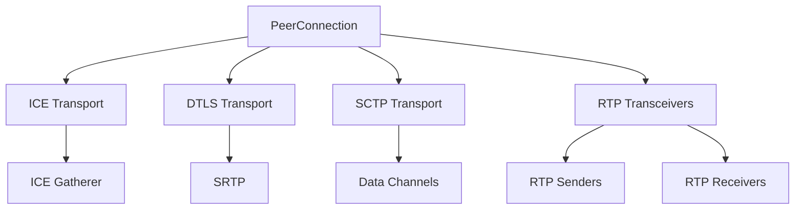

## Introduction to Pion WebRTC

Pion WebRTC is a pure Go implementation of the WebRTC API, providing real-time communication capabilities without relying on C libraries or external dependencies. It enables developers to build scalable, high-performance applications for video conferencing, live streaming, gaming, and IoT communications.

## Core Architecture

Pion WebRTC follows the WebRTC specification while providing a clean, idiomatic Go API. The architecture is built around several key components:



### Key Components

<CardGroup cols={2}>
  <Card title="PeerConnection" icon="link">
    The main entry point for WebRTC connections, managing signaling state and coordinating all transports.
  </Card>
  <Card title="ICE Transport" icon="network-wired">
    Handles network connectivity, gathering candidates and establishing peer-to-peer connections.
  </Card>
  <Card title="Media Streams" icon="video">
    Manages audio and video tracks through RTP transceivers, senders, and receivers.
  </Card>
  <Card title="Data Channels" icon="message">
    Provides bidirectional data transfer over SCTP for arbitrary application data.
  </Card>
</CardGroup>

## Creating a PeerConnection

The `PeerConnection` is the central object in Pion WebRTC. Here's how it's constructed in the source code:

```go peerconnection.go
// PeerConnection represents a WebRTC connection that establishes a
// peer-to-peer communications with another PeerConnection instance in a
// browser, or to another endpoint implementing the required protocols.
type PeerConnection struct {
    id string
    mu sync.RWMutex

    configuration Configuration

    currentLocalDescription  *SessionDescription
    pendingLocalDescription  *SessionDescription
    currentRemoteDescription *SessionDescription
    pendingRemoteDescription *SessionDescription
    signalingState           SignalingState
    iceConnectionState       atomic.Value // ICEConnectionState
    connectionState          atomic.Value // PeerConnectionState

    rtpTransceivers []*RTPTransceiver

    iceGatherer   *ICEGatherer
    iceTransport  *ICETransport
    dtlsTransport *DTLSTransport
    sctpTransport *SCTPTransport

    api *API
}
```

### Basic Usage Example

```go
import "github.com/pion/webrtc/v4"

// Create a new API with default settings
api := webrtc.NewAPI()

// Configure ICE servers (STUN/TURN)
config := webrtc.Configuration{
    ICEServers: []webrtc.ICEServer{
        {
            URLs: []string{"stun:stun.l.google.com:19302"},
        },
    },
}

// Create a PeerConnection
pc, err := api.NewPeerConnection(config)
if err != nil {
    panic(err)
}
defer pc.Close()
```

## The API Object

Pion WebRTC uses an `API` object to configure global settings before creating PeerConnections:

```go api.go
// API allows configuration of a PeerConnection
// with APIs that are available in the standard. This
// lets you set custom behavior via the SettingEngine, configure
// codecs via the MediaEngine and define custom media behaviors via
// Interceptors.
type API struct {
    settingEngine       *SettingEngine
    mediaEngine         *MediaEngine
    interceptorRegistry *interceptor.Registry

    interceptor interceptor.Interceptor
}
```

### Customizing the API

```go
// Create a MediaEngine to configure codecs
mediaEngine := &webrtc.MediaEngine{}
if err := mediaEngine.RegisterDefaultCodecs(); err != nil {
    panic(err)
}

// Create a SettingEngine to configure behavior
settingEngine := webrtc.SettingEngine{}
settingEngine.DetachDataChannels()

// Create an API with custom settings
api := webrtc.NewAPI(
    webrtc.WithMediaEngine(mediaEngine),
    webrtc.WithSettingEngine(settingEngine),
)
```

<Note>
The API object is copied when creating a PeerConnection, so you can safely reuse the same API instance for multiple connections.
</Note>

## Connection Lifecycle

A WebRTC connection goes through several states during its lifetime:

<Steps>
  <Step title="New">
    PeerConnection is created but no networking has begun.
  </Step>
  <Step title="Connecting">
    ICE gathering and DTLS handshake are in progress.
  </Step>
  <Step title="Connected">
    All transports are established and media can flow.
  </Step>
  <Step title="Disconnected">
    Network connectivity has been lost (temporary).
  </Step>
  <Step title="Failed">
    Connection has failed and cannot be recovered.
  </Step>
  <Step title="Closed">
    Connection has been explicitly closed.
  </Step>
</Steps>

### Monitoring Connection State

```go
pc.OnConnectionStateChange(func(state webrtc.PeerConnectionState) {
    fmt.Printf("Connection state changed: %s\n", state)
    
    switch state {
    case webrtc.PeerConnectionStateConnected:
        fmt.Println("Peers connected!")
    case webrtc.PeerConnectionStateFailed:
        fmt.Println("Connection failed")
    case webrtc.PeerConnectionStateClosed:
        fmt.Println("Connection closed")
    }
})
```

## Event Handlers

Pion WebRTC provides several event handlers for monitoring connection state and receiving media:

```go peerconnection.go
pc.OnICECandidate(func(candidate *webrtc.ICECandidate) {
    if candidate != nil {
        // Send candidate to remote peer via signaling
    }
})

pc.OnTrack(func(track *webrtc.TrackRemote, receiver *webrtc.RTPReceiver) {
    // Handle incoming media track
})

pc.OnDataChannel(func(dc *webrtc.DataChannel) {
    // Handle incoming data channel
})

pc.OnNegotiationNeeded(func() {
    // Renegotiation is needed
})
```

## Configuration Options

The `Configuration` struct controls PeerConnection behavior:

```go configuration.go
config := webrtc.Configuration{
    // STUN/TURN servers for NAT traversal
    ICEServers: []webrtc.ICEServer{
        {URLs: []string{"stun:stun.l.google.com:19302"}},
        {
            URLs:       []string{"turn:turn.example.com:3478"},
            Username:   "user",
            Credential: "pass",
        },
    },
    
    // ICE transport policy
    ICETransportPolicy: webrtc.ICETransportPolicyAll, // or Relay
    
    // Bundle policy for media multiplexing
    BundlePolicy: webrtc.BundlePolicyBalanced,
    
    // RTCP multiplexing (required in WebRTC)
    RTCPMuxPolicy: webrtc.RTCPMuxPolicyRequire,
    
    // Pre-generate ICE candidates
    ICECandidatePoolSize: 0,
}
```

<Warning>
Setting `ICETransportPolicy` to `Relay` will force all traffic through TURN servers, which can be useful for privacy but increases latency and server costs.
</Warning>

## Transport Layer

Pion WebRTC uses a layered transport architecture:

1. **ICE Transport**: Handles network connectivity and NAT traversal
2. **DTLS Transport**: Provides encryption on top of ICE
3. **SRTP**: Encrypts RTP media packets
4. **SCTP Transport**: Carries data channel messages

This architecture is initialized automatically when creating a PeerConnection:

```go peerconnection.go
// From NewPeerConnection
pc.iceGatherer, err = pc.createICEGatherer()
if err != nil {
    return nil, err
}

// Create the ice transport
iceTransport := pc.createICETransport()
pc.iceTransport = iceTransport

// Create the DTLS transport
dtlsTransport, err := pc.api.NewDTLSTransport(pc.iceTransport, pc.configuration.Certificates)
if err != nil {
    return nil, err
}
pc.dtlsTransport = dtlsTransport

// Create the SCTP transport
pc.sctpTransport = pc.api.NewSCTPTransport(pc.dtlsTransport)
```

## Thread Safety

Pion WebRTC is designed to be thread-safe. All public methods can be called from multiple goroutines:

```go peerconnection.go
type PeerConnection struct {
    mu sync.RWMutex
    // ...
}
```

<Tip>
While Pion WebRTC handles internal synchronization, you should still be careful about race conditions in your own callback handlers and application state.
</Tip>

## Performance Considerations

- **Zero-copy operations**: Pion minimizes memory copies where possible
- **Efficient packet processing**: Direct integration with the network stack
- **Configurable buffer sizes**: Tune for your use case via SettingEngine
- **Interceptor pipeline**: Modify or inspect media without performance penalties

## Next Steps

<CardGroup cols={2}>
  <Card title="Peer Connection" href="/concepts/peer-connection">
    Deep dive into PeerConnection API and signaling states
  </Card>
  <Card title="Signaling" href="/concepts/signaling">
    Learn about SDP offers, answers, and signaling protocols
  </Card>
  <Card title="ICE & Connectivity" href="/concepts/ice-and-connectivity">
    Understand NAT traversal and ICE candidate gathering
  </Card>
  <Card title="Media Streams" href="/concepts/media-streams">
    Working with audio and video tracks
  </Card>
</CardGroup>
